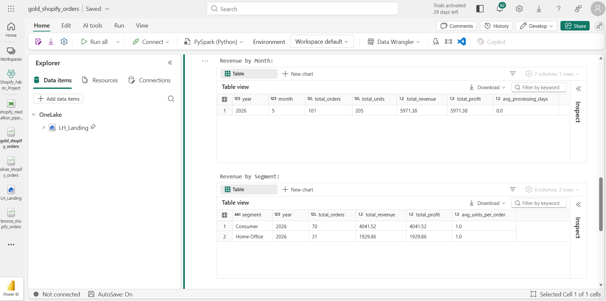
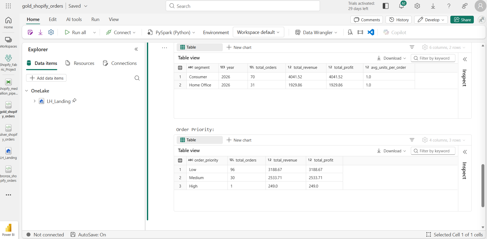

# 🥇 Gold Layer — Shopify Business Aggregations

## Overview
Aggregation layer that transforms clean Silver data into 
business-ready Gold tables optimised for Power BI reporting.

## Architecture
silver_shopify_orders → Aggregate → 3 Gold Delta Tables

## Gold Tables Produced

### gold_revenue_by_month
Monthly revenue and profit summary for trend analysis.
| Column | Description |
|---|---|
| year | Order year |
| month | Order month |
| total_orders | Distinct order count |
| total_units | Total quantity sold |
| total_revenue | Sum of revenue |
| total_profit | Sum of profit |
| avg_processing_days | Average fulfilment time |

### gold_revenue_by_segment
Revenue breakdown by customer segment per year.
| Column | Description |
|---|---|
| segment | Customer segment |
| year | Order year |
| total_orders | Distinct order count |
| total_revenue | Sum of revenue |
| total_profit | Sum of profit |

### gold_order_priority
Order distribution by priority classification.
| Column | Description |
|---|---|
| order_priority | Priority level |
| total_orders | Order count |
| total_revenue | Revenue |
| total_profit | Profit |

## Tech Stack
- Microsoft Fabric
- PySpark SQL
- Delta Lake
- Power BI (consumption layer)

## How to Run
1. Ensure silver_shopify_orders table exists
2. Attach LH_Landing lakehouse
3. Run after Silver notebook completes
